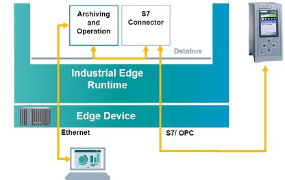

# Archiving & Operation Demo

Archiving, Visualizing and Operation Panel demo application for Industrial Edge

- [Archiving & Operation Demo](#archiving--operation-demo)
  - [Description](#description)
    - [Overview](#overview)
    - [General Task](#general-task)
  - [Requirements](#requirements)
    - [Used Components](#used-components)
    - [TIA Project](#tia-project)
    - [Helpful tools](#helpful-tools)
  - [Installation](#installation)
  - [Usage](#usage)
    - [Information](#information)
  - [Documentation](#documentation)
  - [Contribution](#contribution)
  - [License & Legal Information](#license--legal-information)

## Description

### Overview

The Industrial Edge Application "Archiving & Operation" is based on the "[Archiving & Visualization](https://github.com/industrial-edge/archiving-and-visualization)" Application and extends it with an Operation Panel to control the filling process. With this Application you get a control panel for starting, stopping and resetting the filling process.

### General Task

The Industrial Edge Application "Archiving & Operation" extends the web UI for displaying the recorded and archived data with push buttons to start and stop the filling process and to reset the application. The MQTT-client service used in the "Archiving" application is extended with an API for listening on http requests send by push buttons. After receiving a request over the API, the MQTT-client publishes the control commands to the Industrial Edge System Application IE Databus. The Industrial Edge System Application SIMATIC S7 Connector receives those messages and writes the control commands to PLC which is controlling the filling process.

You can find the further information about the application [here](docs/overview.md)

## Requirements

### Used Components

- OS: Windows or Linux
- Docker minimum V18.09
- Docker Compose V2.0 – V2.4
- Industrial Edge App Publisher (IEAP) V1.2.8
- Industrial Edge Management (IEM) V1.2.16
  - S7 Connector V1.2.26
  - S7 Connector Configurator V1.2.38
  - IE Databus V1.2.16
  - IE Databus Configurator V1.2.29
  - IE App Configuration Service V1.0.5
- Industrial Edge Device (IED) V1.2.0-56
- TIA Portal V16 
- PLC: CPU 1512 FW 2.8.3

### TIA Project

The used TIA Portal project can be found in the [miscellaneous repository](https://github.com/industrial-edge/miscellaneous) in the tank application folder and is also used for several further application examples:

- [Tia Tank Application](https://github.com/industrial-edge/miscellaneous/tree/main/tank%20application)

### Helpful tools

- Any development environment (e.g. Visual Studio Code, Eclipse, …)
- Docker Extension for your development environment e.g. Visual Studio Code Extension

## Installation

You can find the further information about the following steps in the [docs](docs/installation.md)

- [Build application](docs/installation.md#build-application)
- [Upload application to Industrial Edge Management](docs/installation.md#upload-application-to-industrial-edge-management)
- [Configure and install application to Industrial Edge Device](docs/installation.md#install-application-on-industrial-edge-device)

## Usage

### Information

> :warning: This application exposes accessible API endpoints protected by username and password. Protect your Industrial Edge Device from unauthorized access and don't share your API username and password. This application is only a How To and is not designed to be used in a production environment.

## Documentation

- Here is a link to the [docs](docs/) of this application example.
- You can find further documentation and help in the following links
  - [Industrial Edge Hub](https://iehub.eu1.edge.siemens.cloud/#/documentation)
  - [Industrial Edge Forum](https://www.siemens.com/industrial-edge-forum)
  - [Industrial Edge landing page](https://new.siemens.com/global/en/products/automation/topic-areas/industrial-edge/simatic-edge.html)
  
## Contribution

Thanks for your interest in contributing. Anybody is free to report bugs, unclear documentation, and other problems regarding this repository in the Issues section or, even better, is free to propose any changes to this repository using Merge Requests.

## License & Legal Information

Please read the [Legal information](LICENSE.md).
