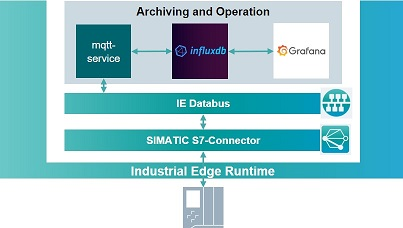

# Application overview

The Industrial Edge Application "Archiving & Operation" is based on the "Archiving" Application and extends it with an Operation Panel to control the filling process. 

- [Application overview](#application-overview)
  - [General Task](#general-task)
  - [Application Architecture](#application-architecture)
  - [MQTT Service](#mqtt-service)
  - [InfluxDB Service](#influxdb-service)
  - [Grafana Service](#grafana-service)

## General Task

The Industrial Edge Application "Archiving & Operation" extends the web UI for displaying the recorded and archived data with push buttons to start and stop the filling process and to reset the application. The MQTT-client service used in the "Archiving" application is extended with an API for listening on http requests send by push buttons. After receiving a request over the API, the MQTT-client publishes the control commands to the Industrial Edge System Application IE Databus. The Industrial Edge System Application SIMATIC S7 Connector receives those messages and writes the control commands to PLC which is controlling the filling process.

## Application Architecture

The Industrial Edge Application "Archiving & Operation" is using the microservice architecture. The application is separated in three independent components which do independent tasks.

## MQTT Service

The "MQTT Service" handles all communication tasks to the Industrial Edge System Application IE-Databus. The service uses a MQTT-client to subscribe to MQTT-topics on the IE Databus to read the values published by the SIMATIC S7 Connector. The values are forwarded using http to the "InfluxDB Service".

The "MQTT Service" also provides a web API based on HTTP methods for listening on control commands send from the "Grafana Service" The received control command request are forwarded to the MQTT-client which publishes messages on MQTT-topics on the IE Databus.

## InfluxDB Service

The "InfluxDB Service" implements InfluxDB an open source time series database to archive the recorded data. The InfluxDB provides a RESTful web API based on http for storing and accessing data inside the database.

## Grafana Service

The "Grafana Service" implements Grafana a open source web application for data visualization. Therefore, it provides charts, graph and alerts and can connect to various supported data sources. The InfluxDB of the "InfluxDB Service" serves as the data source of Grafana. The data provided by the database are displayed in the "Grafana Service" using charts and graphs.

For controlling and operating the filling process a plugin which implements push buttons to Grafana is used. The implemented buttons send http requests to the web API provided by the "MQTT Service".